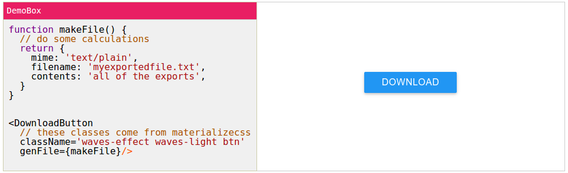

<!--
---
title: DownloadButton
colors: pink
fontPair: Fugaz One
ga: UA-7002862-5
source: https://github.com/notablemind/downloadbutton/raw/master/Readme.md
css: |
  .DownloadButton {
    font-size: 16px;
    font-family: sans-serif;
  }
styles:
  - https://cdnjs.cloudflare.com/ajax/libs/font-awesome/4.3.0/css/font-awesome.min.css
  - https://cdnjs.cloudflare.com/ajax/libs/materialize/0.95.0/css/materialize.min.css
scripts:
  - download-button.js
  - https://code.jquery.com/jquery-2.1.1.min.js
  - https://cdnjs.cloudflare.com/ajax/libs/materialize/0.95.0/js/materialize.min.js
links:
  home:
  demos: demo.html
  github: https://github.com/notablemind/downloadbutton

---
-->

<!-- @demobox hide -->
View this page rendered at [notablemind.github.io/downloadbutton](http://notablemind.github.io/downloadbutton)

[](http://notablemind.github.io/downloadbutton)
<!-- @demobox /hide -->

DownloadButton is a simple component for letting the user **download a
javascript-generated file.** It was extracted from
[Notablemind](https://github.com/notablemind/notablemind).

The styling is due to [materializecss](http://materializecss.com/), and does
not come with the `DownloadButton` component. You are free to style the
component however you wish.

## Demo

```jsx
// @demobox
function makeFile() {
  // do some calculations
  return {
    mime: 'text/plain',
    filename: 'myexportedfile.txt',
    contents: 'all of the exports',
  }
}


<DownloadButton
  // these classes come from materializecss
  className='waves-effect waves-light btn' 
  genFile={makeFile}/>
```

For more demos, see [the demo page](demo.md).

## Node Start

```bash
npm install --save downloadbutton
```

```js
var DownloadButton = require('downloadbutton')

// use it somewhere!
```

If you're not using browserify, you'll need to use the precompiled version, as
the source is written using `jsx` and `es6` syntax.

```js
var DownloadButton = require('downloadbutton/es5')

// use it
```

## API

### Props
[view demo](https://notablemind.github.io/downloadbutton/demo.html)

If you generate the file asynchronously, you need to set `async` to true, and
use the next section.

Name | Type | Description
--- | --- | ---
`fileData` | [fileData](#the-filedata-type) | If passed in, genFile will be ignored, and this file will be served.
`genFile` | `fn () -> fileData` | Synchronously generate the file data. See [below](#the-filedata-type) for a description of the `fileData` type
`downloadTitle` | `string` or react element, or `fn (fileData) -> string / react element` | The text shown on the button. If a function, it will be passed the `fileData` (if it has been passed in as props). Default: `"Download"`

You must pass in either `fileData` or `genFile`.

### Props (async=true)
[view demo](https://notablemind.github.io/downloadbutton/demo.html#asynchronous-generation)

If `fileData` is passed in as a prop, the `async` prop is **ignored**, and the
component will use the synchronous behavior.

Name | Type | Description
--- | --- | ---
`async` | `bool` | Set to true if `genFile` is an async function. Default: false.
`genFile` | `fn (done: fn (fileData))` | `genFile` is an async function that receives the callback as its only argument. The callback must be called with a `fileData` object.
`generateTitle` | `string` or react element | The text shown initially. Default: `"Generate file"`
`loadingTitle` | `string` or react element | The text shown while the file is being generated. Default: `"Loading..."`
`downloadTitle` | `string` or react element, or `fn (fileData) -> string / react element` | The text shown once the file has been generated. If a function, it will be passed the generated `fileData`. Default: `"Download"`

### The `fileData` type

```json
{
  mime: str,
  filename: str,
  content: str
}
```

Example:

```json
{
  mime: "application/json",
  filename: "generated.json",
  content: '{"hello": "world"}'
}
```


